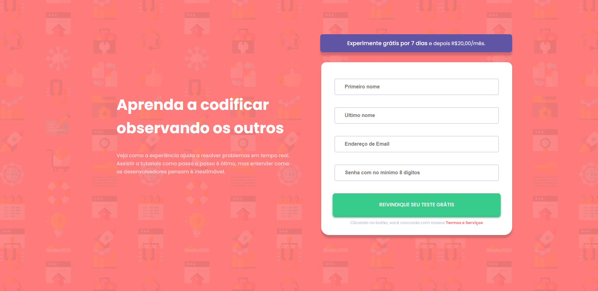
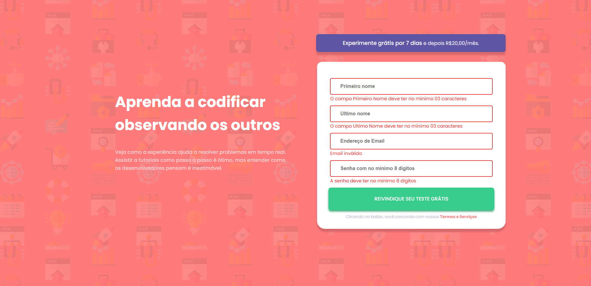
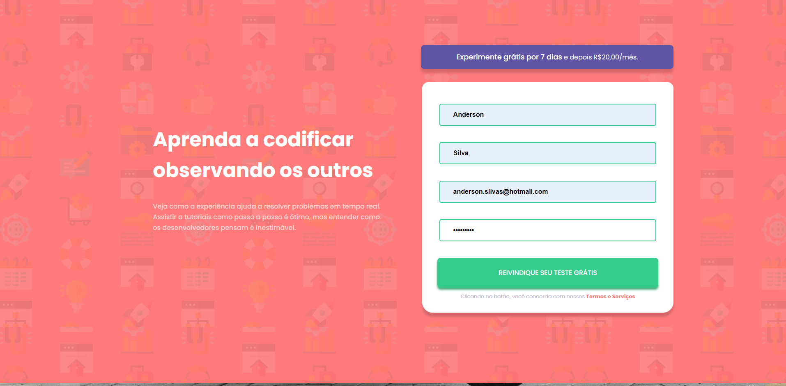

# huddle-landing-page
Landing page responsiva, dividida em seções. Cada seção contém uma caixa que recebe seus respectivos elementos(Imagem de referência e texto de descrição).

## Preview 

	

	

	

	

### Tarefas 

- [X] Primeiro commit 
- [X] Criar estrutura de pastas
- [X] Criar e importar arquivos css
- [X] Importar Bootstrap
- [X] Adicionar imagens 
- [X] Estrutura inicial HTML
- [X] Criar estrutura da página por tópicos
- [X] Criar navbar com logo e botão
- [X] Adicionar brackground
- [X] Adicionar contéudos da seção inicial
- [X] Posicionando os elementos da seção inicial de forma centralizada/
- [X] Importar fontes
- [X] Aplicar as fontes em seus determinados lugares
- [X] Criar root com as cores 
- [X] Personalizar botão get started
- [X] Personalizar botão try it free
- [X] Criar estrutura da segunda seção
- [X] Adicionar box-shadow a box1 da seção 2
- [X] Criar estrutura inicial da caixa 1 da segunda seção 
- [X] Alinhar elementos da box 1 da seção 2
- [X] Estilizar elementos da box 1 da seção 2
- [X] Criar estrutura da terceira seção
- [X] Adicionar box-shadow a box2 da seção 3
- [X] Criar estrutura inicial da caixa 1 da terceira seção 
- [X] Alinhar elementos da box 2 da seção 3
- [X] Estilizar elementos da box 3 da seção 4
- [X] Criar estrutura da terceira seção
- [X] Adicionar box-shadow a box4 da seção 4
- [X] Criar estrutura inicial da caixa 1 da quarta seção 
- [X] Alinhar elementos da box 2 da seção 4
- [X] Estilizar elementos da box 2 da seção 4
- [X] Criar estrutura com conteúdo da última seção
- [X] Criar caixa para botão get started e descrição
- [X] Estilizar conteúdo da última seção
- [X] Criar o footer 
- [X] Colocar cor de background do footer
- [X] Posicionar a caixa entre a seção 4 e o footer
- [X] Adicionar e estilzar elementos do footer

## Tecnologias 
- HTML
- CSS
- BOOTSTRAP

## Deploy 
https://huddle-landing-page-sage-five.vercel.app/

# Autor 
## Anderson Silva
